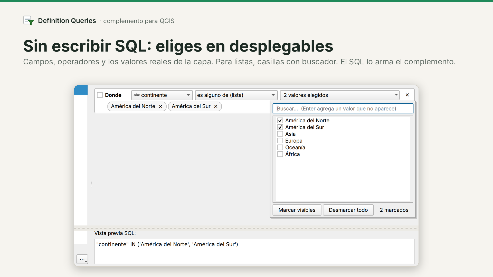
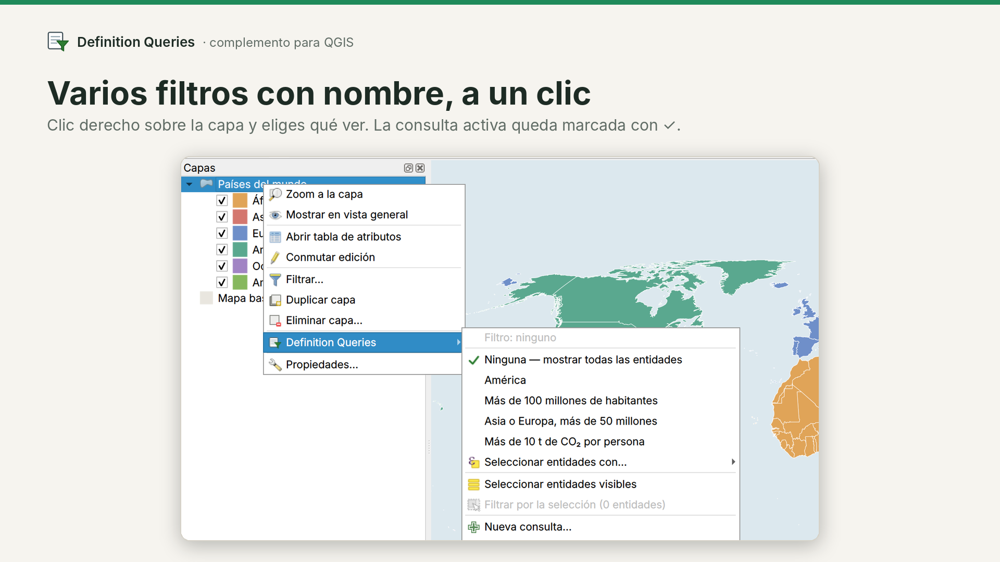
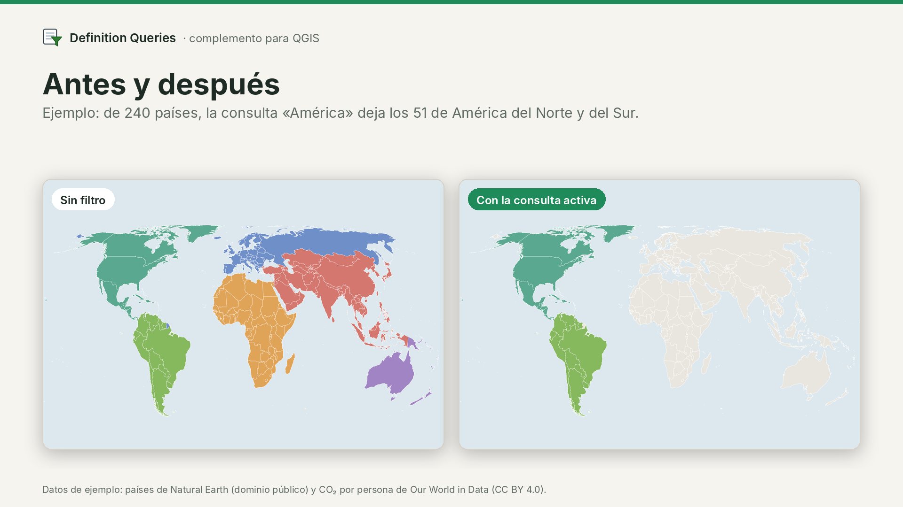
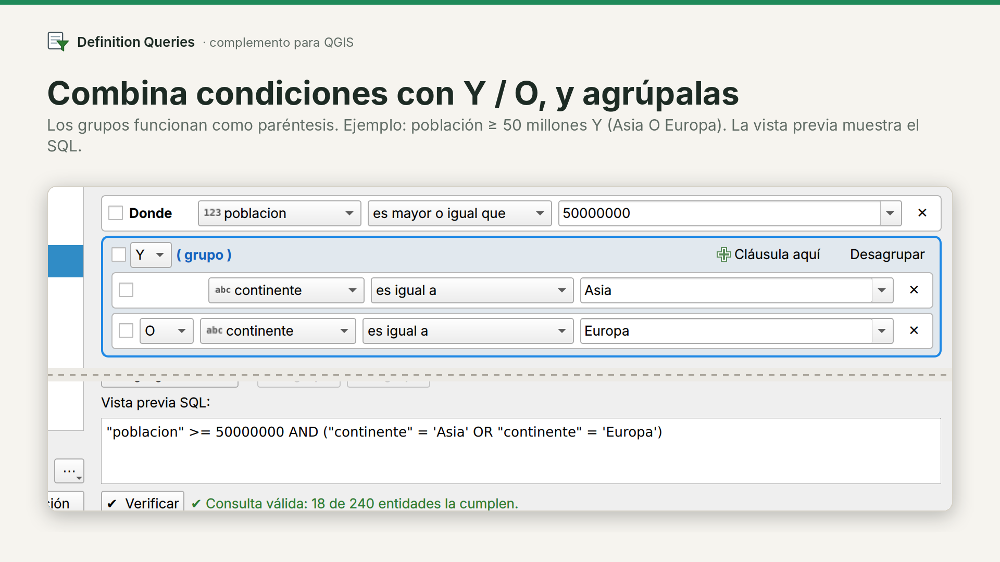
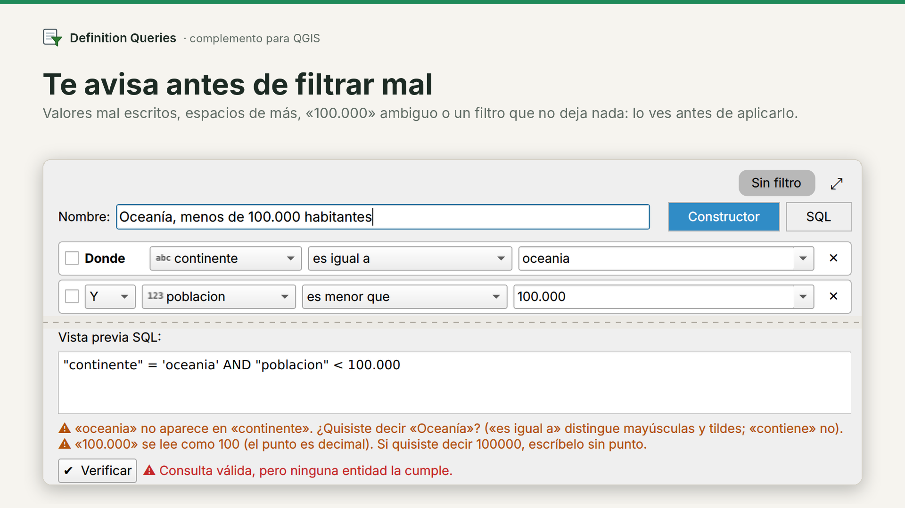

# Definition Queries

[English](README.md) · **Español** · [Português](README.pt.md)

**Filtra tus capas en QGIS sin escribir SQL.** Eliges campo, operador y valores en desplegables (con los valores reales de la capa) y el complemento arma la consulta por ti.

QGIS ya permite filtrar capas con *Filtrar…*, pero hay que escribir la expresión SQL a mano y solo se guarda un filtro por capa. Con Definition Queries:

- **Sin SQL:** constructor visual con listas de casillas, Y / O, grupos y subgrupos.
- **Varias consultas con nombre por capa**, guardadas en el proyecto, que cambias con un clic derecho.
- **Avisos antes de filtrar mal** (valor mal escrito, número ambiguo, filtro que no deja nada, campo que cambió de nombre).

QGIS 3.34 o superior. Interfaz en inglés, español y portugués (sigue el idioma de QGIS).

*Imágenes de ejemplo: países del mundo de Natural Earth (dominio público) con CO₂ por persona de Our World in Data (CC BY 4.0).*

## Qué hace

- **Varias consultas con nombre por capa**, guardadas dentro del proyecto (.qgz). Doble clic para renombrar, arrastrar para ordenar.
- **Cambia de consulta con clic derecho sobre la capa.** La activa queda marcada con ✓.
- **Constructor visual**: `Donde [campo ▾] [operador ▾] [valor ▾]`, con los valores reales de la capa, listas de casillas con buscador, y grupos y subgrupos (paréntesis) sin límite de niveles.
- **Los operadores de ArcGIS**: es (no es) igual a, es alguno / ninguno de, contiene / no contiene, comienza / no comienza con, termina / no termina con, mayor / menor que, está (no está) entre, está en blanco, es nulo. Para fechas: es el, no es el, es anterior a, es posterior a, es el o antes de, es el o después de.
- **Modo SQL** cuando lo necesitas. Al volver al constructor, el SQL se convierte en cláusulas cuando se puede, y se comprueba con los datos que dejen las mismas entidades.
- **Verificar**: cuántas entidades cumplen la consulta, antes de aplicarla.
- **Filtrar o seleccionar** con la misma consulta (nueva selección, agregar, quitar o seleccionar dentro).
- **Seleccionar entidades visibles**: selecciona lo que ves en el mapa (con el filtro de la capa, sin las categorías apagadas en la leyenda y respetando el Controlador temporal), como en ArcGIS.
- **Filtrar por selección**, con un nombre propuesto.
- **Avisos**: valor mal escrito («¿quisiste decir…?»), espacios de más, un «1.000» o un «03/04/2025» ambiguos, un valor vacío, «Y» y «O» mezclados sin grupo, un filtro que no deja entidades, y campos usados por las consultas que ya no existen en la capa (con una herramienta para reemplazarlos en todas las consultas).
- **Sincronizado con «Filtrar…» de QGIS**: los filtros puestos ahí aparecen en la lista.
- **Herramientas de Processing** para usar las consultas en modelos y procesos por lotes.
- **Exportar e importar** consultas (JSON o texto).

| | |
|---|---|
|  |  |
|  |  |

## El mismo resultado en todos los formatos

Cada formato evalúa los filtros a su manera: en GeoPackage `LIKE` ignora mayúsculas solo en letras sin tilde; en Shapefile, GeoJSON o FileGDB `=` ignora mayúsculas; `_` y `%` dentro de un texto son comodines; las fechas-hora se comparan como texto. El complemento escribe el SQL para cada motor, así las reglas son las mismas en todos:

- **«es igual a» / «es alguno de»**: coincidencia exacta (distingue mayúsculas y tildes). En las listas, los espacios al inicio o al final se muestran como «␣», para distinguir «Vega» de «Vega ».
- **«contiene» / «comienza con» / «termina con»**: no distingue mayúsculas, también en letras con tilde (Á/á, Ñ/ñ). `_` y `%` no son comodines. Las tildes sí cuentan: «arbol» no encuentra «árbol».
- **Valores vacíos**: si el campo los tiene, las listas de valores muestran «<Nulo>» (sin valor) y «<Vacío>» (un texto sin nada escrito), como en ArcGIS. Se eligen como cualquier otro valor («es igual a <Nulo>», «es alguno de: A, <Vacío>»). Las negaciones («no es igual a», «no es ninguno de», «no contiene»…) dejan fuera los nulos, como en SQL y ArcGIS, así los conteos coinciden. Shapefile y CSV no pueden guardar un texto vacío: ahí se lee como <Nulo>.
- **Un valor vacío no filtra**: la cláusula queda pendiente hasta que eliges un valor (usa «está en blanco» para buscar vacíos).
- **Fechas**: se aceptan `AAAA-MM-DD`, `DD-MM-AAAA` y `DD/MM/AAAA`. En un campo de fecha y hora, una fecha sola es el día completo: «es el 2024-03-03» encuentra todas las horas de ese día y «es posterior a 2024-03-03» empieza el día 4. Una fecha y hora elegida de la lista también encuentra ese mismo segundo cuando los datos guardan milisegundos.
- **Seleccionar** usa exactamente el mismo SQL que el filtro.

Estas reglas se comprueban con los scripts de [`tests/`](tests/README.md), que cualquiera puede ejecutar: en cada formato (GeoPackage, Shapefile, GeoJSON, FlatGeobuf, FileGDB, Excel, SpatiaLite, CSV, capa temporal, capa virtual y, con un servidor, PostGIS) cada operador se compara con un resultado calculado aparte en Python, usando valores elegidos para causar problemas (mayúsculas, tildes, `_` y `%`, comillas, `\`, espacios al inicio y al final, vacíos y nulos, fechas, fechas-hora, verdadero/falso), más 150 combinaciones al azar con grupos. También cubren campos renombrados, valores que cambian, capas duplicadas, selecciones grandes, zonas horarias, datos del proyecto dañados y cambios de operador o de campo en una cláusula.

## Instalación

QGIS → *Complementos → Administrar e instalar complementos* → busca «Definition Queries». O descarga `definition_queries.zip` desde [Releases](https://github.com/nfig-94/definition_queries/releases) → *Instalar a partir de ZIP*.

## Uso rápido

1. Clic derecho sobre una capa vectorial → **Definition Queries → Nueva consulta…**
2. Elige campo, operador y valor (o varios valores). Revisa la vista previa y pulsa **Verificar**.
3. **Aplicar filtro**. Para cambiar de consulta, clic derecho sobre la capa y eliges otra.

## Conviene saber

- Las consultas se guardan en la capa dentro del proyecto. Si quitas la capa y vuelves a agregar el archivo, no estarán (expórtalas antes, o guarda el estilo de la capa: el .qml las conserva).
- Si cambia el nombre de un campo que usa una consulta, la capa queda sin entidades y el complemento te avisa. Se arregla en *Administrar consultas… → ⋯ → Reemplazar un campo en todas las consultas*.
- «Filtrar por selección» usa la clave de la capa o un campo ID único. Los ID consecutivos se guardan como rangos; con miles de entidades salteadas el filtro funciona, pero el mapa puede ir lento, y el complemento te avisa. Si la capa no tiene campo ID (p. ej. un Shapefile sin él), avisa que el número interno de las entidades puede cambiar al editar el archivo.
- Una capa en modo edición no se puede filtrar: guarda o descarta los cambios primero (igual que en QGIS).
- Sin grupos, «Y» se evalúa antes que «O» (como en SQL): `A o B y C` = `A o (B y C)`. La vista previa siempre muestra los paréntesis.
- Los filtros de capa solo pueden usar campos de la propia fuente de datos; los campos unidos o virtuales no se ofrecen.
- En Shapefile, GeoJSON y otros formatos de GDAL, una lista de más de 32 textos con letras no distingue mayúsculas de minúsculas (limitación de GDAL: la forma exacta deja el mapa muy lento). El complemento avisa cuando eso cambia el resultado.
- Otras fuentes de datos (SQL Server, Oracle, WFS…) no se han probado: el complemento lo indica, y su base de datos aplica sus propias reglas (por ejemplo, con las mayúsculas). Comprueba el resultado con **Verificar**.

## Compartir el proyecto con alguien que no tiene el complemento

- La capa muestra el mismo filtro activo (es un filtro normal de QGIS, editable en *Filtrar…*).
- Las demás consultas viajan dentro del .qgz.
- Opcional: *⋯ → Dejar nota en las capas para quien no tiene el complemento* agrega a las notas de cada capa el SQL de cada consulta, para pegarlo en *Filtrar…*. Viene desactivado y nunca toca las notas propias de la capa.

## Comparado con otras herramientas

*Filtrar…* de QGIS guarda un filtro escrito a mano por capa. El complemento [QuerySelection](https://plugins.qgis.org/plugins/QuerySelection/) crea un filtro a partir de las entidades seleccionadas. Definition Queries guarda varios filtros con nombre por capa, los arma sin SQL y también los crea desde una selección. Está inspirado en las *definition queries* de ArcGIS.

## Cómo se hizo

Desarrollado por Nicolás Figueroa Arthur con ayuda de un asistente de IA (Claude, de Anthropic). La lógica de filtrado se comprueba con las pruebas de [`tests/`](tests/README.md). Probado en QGIS 3.34; la compatibilidad con QGIS 4 se revisó con el verificador Qt6 del repositorio de complementos. Los reportes y sugerencias son bienvenidos en [Issues](https://github.com/nfig-94/definition_queries/issues).

## Licencia

GPL-2.0 o posterior.
