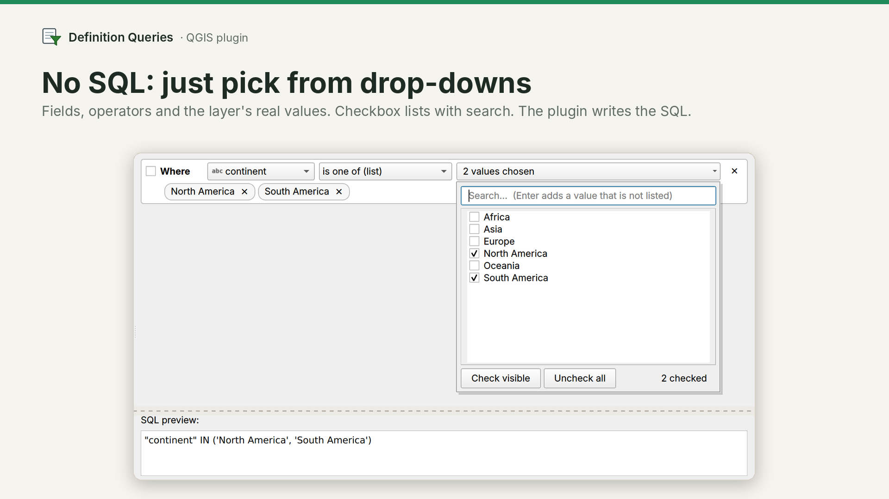
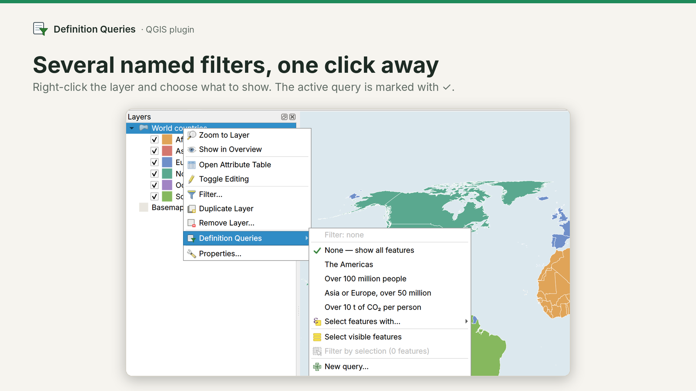
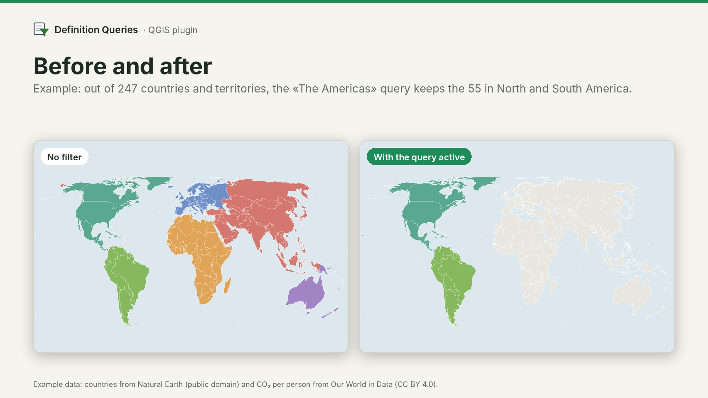
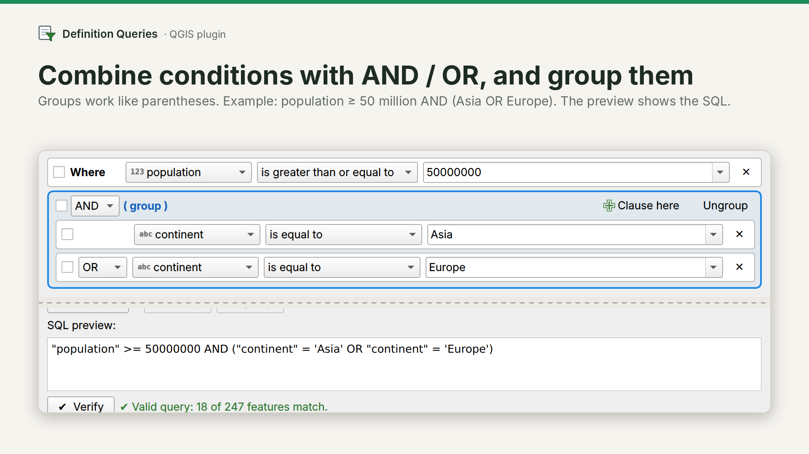
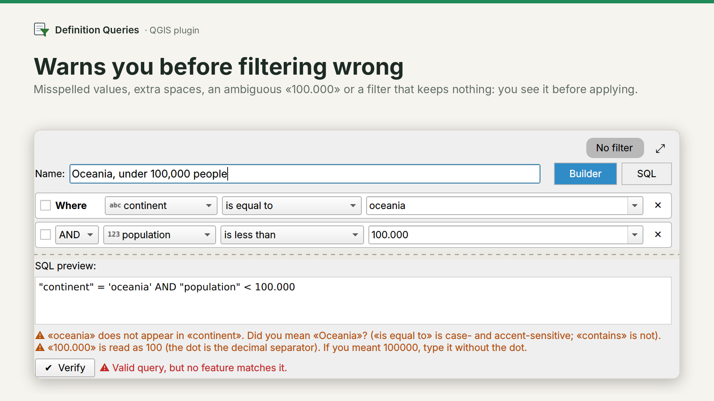

# Definition Queries

**English** · [Español](README.es.md) · [Português](README.pt.md)

**Filter your QGIS layers without writing SQL.** Pick field, operator and values from drop-downs (with the layer's real values) and the plugin writes the query for you.

QGIS can already filter a layer with *Filter…*, but you have to type the SQL expression by hand and each layer keeps only one filter. With Definition Queries:

- **No SQL:** a visual builder with checkbox lists, AND / OR, groups and subgroups.
- **Several named queries per layer**, saved in the project, switched with a right-click.
- **Warnings before filtering wrong** (misspelled value, ambiguous number, a filter that keeps nothing, a field that was renamed).

QGIS 3.34 or later. Interface in English, Spanish and Portuguese (it follows the QGIS language).

*Example images: world countries from Natural Earth (public domain) with CO₂ per person from Our World in Data (CC BY 4.0).*

## What it does

- **Several named queries per layer**, saved inside the project (.qgz). Double-click to rename, drag to reorder.
- **Switch queries with a right-click on the layer.** The active one is marked with ✓.
- **Visual builder**: `Where [field ▾] [operator ▾] [value ▾]`, using the layer's real values, checkbox lists with search, and groups and subgroups (parentheses) with no depth limit.
- **The operators of ArcGIS**: is (not) equal to, is one of / none of, contains / does not contain, starts / does not start with, ends / does not end with, greater / less than, is (not) between, is blank, is null. For dates: is on, is not on, is before, is after, is on or before, is on or after.
- **SQL mode** when you need it. Back in the builder, the SQL becomes clauses whenever possible, and the data is checked to make sure they keep the same features.
- **Verify**: how many features match the query, before applying it.
- **Filter or select** with the same query (new selection, add, remove or select within).
- **Select visible features**: selects what you see in the map view (with the layer's filter, without the categories turned off in the legend and following the Temporal Controller), like in ArcGIS.
- **Filter by selection**, with a suggested name.
- **Warnings**: misspelled value («did you mean…?»), extra spaces, an ambiguous «1.000» or «03/04/2025», an empty value, AND and OR mixed without a group, a filter that keeps no features, and fields used by the queries that no longer exist in the layer (with a tool to replace them in every query).
- **In sync with QGIS «Filter…»**: filters set there show up in the list.
- **Processing tools** to use the queries in models and batch processes.
- **Export and import** queries (JSON or plain text).

| | |
|---|---|
|  |  |
|  |  |

## Same result in every format

Each format evaluates filters its own way: in GeoPackage `LIKE` is case-insensitive but only for unaccented letters; in Shapefile, GeoJSON or FileGDB `=` ignores case; `_` and `%` inside a text act as wildcards; date-times are compared as text. The plugin writes the SQL for each engine so the rules are the same everywhere:

- **«is equal to» / «is one of»**: exact match (case- and accent-sensitive). In the value lists, spaces at the start or end are shown as «␣», so «Vega» and «Vega » can be told apart.
- **«contains» / «starts with» / «ends with»**: case-insensitive, also for accented letters (Á/á, Ñ/ñ). `_` and `%` are not wildcards. Accents do count: «arbol» does not find «árbol».
- **Empty values**: the value lists show «<Null>» (no value) and «<Empty>» (a text with nothing written) when the field has them, as in ArcGIS. Pick them like any other value («is equal to <Null>», «is one of: A, <Empty>»). Negations («is not equal to», «is none of», «does not contain»…) leave null values out, as in SQL and ArcGIS, so counts match. Shapefile and CSV cannot store an empty text: there it is read as <Null>.
- **An empty value does not filter**: the clause stays pending until you choose a value (use «is blank» to find empty values).
- **Dates**: `YYYY-MM-DD`, `DD-MM-YYYY` and `DD/MM/YYYY` are accepted. On a date-time field a date alone means the whole day: «is on 2024-03-03» finds every time of that day and «is after 2024-03-03» starts on the 4th. A date-time picked from the list also finds that same second when the data stores milliseconds.
- **Select** uses exactly the same SQL as the filter.

These rules are checked by the scripts in [`tests/`](tests/README.md), which anyone can run: for each format (GeoPackage, Shapefile, GeoJSON, FlatGeobuf, FileGDB, Excel, SpatiaLite, CSV, temporary layer, virtual layer and, with a server, PostGIS) every operator is compared with a result computed independently in Python, using values chosen to cause trouble (case, accents, `_` and `%`, quotes, `\`, leading and trailing spaces, empty and null values, dates, date-times, true/false), plus 150 random combinations with groups. They also cover renamed fields, changed values, duplicated layers, large selections, time zones, damaged project data and changing the operator or field of a clause.

## Installation

QGIS → *Plugins → Manage and Install Plugins* → search «Definition Queries». Or download `definition_queries.zip` from [Releases](https://github.com/nfig-94/definition_queries/releases) → *Install from ZIP*.

## Quick start

1. Right-click a vector layer → **Definition Queries → New query…**
2. Pick field, operator and value (or several values). Check the preview and click **Verify**.
3. **Apply filter**. To switch queries, right-click the layer and pick another one.

## Good to know

- The queries are stored in the layer inside the project. If you remove the layer and add the file again, they are not there (export them first, or save the layer style: the .qml keeps them).
- If a field used by a query is renamed, the layer shows no features and the plugin tells you. Fix it in *Manage queries… → ⋯ → Replace a field in all queries*.
- «Filter by selection» uses the layer key or a unique ID field. Consecutive IDs are stored as ranges; with thousands of scattered features the filter works but the map can be slow, and the plugin tells you. If the layer has no ID field (e.g. a Shapefile without one), you are warned that internal feature numbers may change when the file is edited.
- A layer in edit mode cannot be filtered: save or discard the changes first (as in QGIS).
- Without groups, «AND» is evaluated before «OR» (as in SQL): `A or B and C` = `A or (B and C)`. The preview always shows the parentheses.
- Layer filters can only use fields of the data source itself; joined or virtual fields are not offered.
- In Shapefile, GeoJSON and other GDAL formats, a list of more than 32 texts containing letters does not tell upper and lower case apart (a GDAL limitation: the exact form makes the map very slow). The plugin warns you when that changes the result.
- Other data sources (SQL Server, Oracle, WFS…) have not been tested: the plugin says so, and their database applies its own rules (for example, for upper/lower case). Check the result with **Verify**.

## Sending the project to someone without the plugin

- The layer shows the same active filter (it is a regular QGIS filter, editable in *Filter…*).
- The other queries travel inside the .qgz.
- Optional: *⋯ → Leave a note on layers…* adds to each layer's notes the SQL of every query, so they can be pasted into *Filter…*. It is off by default and the layer's own notes are never touched.

## Compared with other tools

QGIS *Filter…* keeps one hand-written filter per layer. The [QuerySelection](https://plugins.qgis.org/plugins/QuerySelection/) plugin creates a filter from the selected features. Definition Queries keeps several named filters per layer, builds them without SQL and also creates them from a selection. It is inspired by ArcGIS *definition queries*.

## How it was made

Developed by Nicolás Figueroa Arthur with the help of an AI assistant (Claude, by Anthropic). The filtering logic is checked with the tests in [`tests/`](tests/README.md). Tested on QGIS 3.34; compatibility with QGIS 4 was checked with the plugin repository's Qt6 checker. Reports and suggestions are welcome in [Issues](https://github.com/nfig-94/definition_queries/issues).

## License

GPL-2.0 or later.
